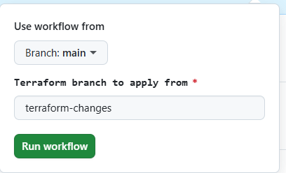

# SimpleTimeService

## TASK 1- Minimalist Application Development / Docker / Kubernetes. 

In task one we create a simple python program to list return us the timestamp and ip of the container its running on. We are containzing the function using docker. to containerize the function we have added a Dockerfile which added python and flask dependance and then run the function inside a container. 

The generated image is been stored at - https://hub.docker.com/repository/docker/tejas1045/simple-time-service/general

we can directly pull the image and use the docker run command to run the container as mentioned in step no 3.

### pre-requisites
 Docker installed

### Steps to follow

##### 1. Git clone the repository and check you are checkout to "main" branch.

    Repo Link main branch - https://github.com/Tejas1045/SimpleTimeService/tree/main

    Repo Link to clone- https://github.com/Tejas1045/SimpleTimeService.git

##### 2. Run the docker build command to build the image locally.

    CMD -  docker build -t <image-name>:<tag> <path-to-dockerfile>

    Actual CMD - docker build -t simple-time-service:latest .

    this will build the image in the local.

##### 3. Run the container using following command, to check on the function.

    CMD - docker run -p <host_port>:<container_port> <image_name>:<image_tag>

    Actual CMD - docker run -p 5000:5000 simple-time-service:latest

    After running the command, the container will run the function. we can check the output on http://localhost:5000/


## TASK 2- Terraform and Cloud: create the infrastructure to host your container.

For the task 2 we have used terrafrom to deploy the function on serverless lambda function using vpc subsets and API gateways to trigger the lambda function. the python progran and docker file is modified accordingly to the lambda function to handle the lambda function trigger.

### pre-requisites
Terraform
AWS CLI
Docker
AWS cloud access

### Steps to follow

#### 1. Git clone the repository and check you are checkout to "terrafrom-changes" branch.

    Repo Link terraform changes branch - https://github.com/Tejas1045/SimpleTimeService/tree/terraform-changes

    Repo Link to clone- https://github.com/Tejas1045/SimpleTimeService.git

    run the command "git checkout terrafrom-changes"

#### 2. Create a AWS user in IAM.

Create a IAM user with either with admin access or we can add the accesss to specific resources like s3, api gateway, EC2, dynamodb, VPC, ECR, IAM EC2 network ploicies. Copy the access key and secret key for further use.

#### 3. Create ECR Repository - simple-time-service

Create A private repositoy in the ECR to store the image for the lambda function. 

#### 4. Creating image and pushing it to ECR repositoy.

To push the image to ECR, we need to build the image first. so clone the git reposiory and make sure we checkout to terrafrom-change branch.

After the clone we need to export the access key, secret key and the default region on terminal. 
if we are using the bash terminal or linux system follow following commands. 

```bash
export AWS_ACCESS_KEY_ID="<access-key>"
export AWS_SECRET_ACCESS_KEY="<secret-key>"
export AWS_DEFAULT_REGION="<region>"
```

In the ECR repository we created we have a tab call ed "view push Commands" which helps us to login to ECR and the push the image to the repository. follow the steps. 

**4.1** login command 

**4.2** Build the image

**4.3** tag the image

**4.4** push the image

All the steps commands are present in the "view push command" section.

After we pus hthe image copy the image URL and add it to the main.tf file to the lambda defination.

    resource "aws_lambda_function" "simple_time_service" {
    function_name = "simple_time_service"
    role          = aws_iam_role.lambda_exec_role.arn
    package_type  = "Image"
    `image_uri     = "<Your Image URL>"`
    timeout       = 10

    vpc_config {
        subnet_ids         = aws_subnet.private[*].id
        security_group_ids = [aws_security_group.lambda_sg.id]
    }
    }

#### 5. Create S3 bucket and Dynamodb table for remote statefile.

Now we can create a S3 bucket  to store the statefile in the remote location which helps multiple people the work on the functions at the same time. where a we need to create a dynamodb table to keep a tack of lock on the s3 bucket while some one is running the terraform task. To avoid multiple interaction with statefile at a time. 

After creating S3 bucket and dynamodb, we need tyo store the bucket name and table value in "backend.tf" file.

    terraform {
    backend "s3" {
        bucket         = "<S3_bucket_name>"
        key            = "<filepath-to-statefile>"
        region         = "<region>"
        dynamodb_table = "<dynamodb_table_name>"
        encrypt        = true
        }
    }

#### 6. Deploying resources manually and workflow

##### 6.1 Manual deplyment

we can deploy the terrafrom resources manually. by using terrafrom command in the terminal were we have cloned the repository. 

**6.1.1:** locally go to the repository were it is cloned and the access key and secret key are exported. or check for the command form step no 3 and execute them. 

**6.1.2:**  after the export we need to initiate the repository to terrafrom so run the following command. this will initiate the backend configurations for terrafrom and download the required modules or dependancies.

    terrafrom init

**6.1.3:** After a successful init we can do a terrafrom plan to check for the resources which will be created when deployed.

    terrafrom plan

**6.1.4:** After a plan we can go ahead and to apply to deply the terrafrom resources. This will create the resources mentioned in the terrafrom configurations in the branch.

    terraform apply 

**6.1.5:** After the successful deployment we can verify the output from the output url we get after the apply completion. which is a apigate way URL to trigger the lambda function and get the output.

**6.1.6:** After the verification we can delete the resources created by terrafrom by using the following command. 

    terrafrom destroy

##### Workflow method. 

before using the workflows we need to add some secrets to repository which are used in workflows. 
path to secrets is -- settings-> secrets and variables -> Actions -> Repository secrets -> new repository secret

Secret Name	Purpose

    AWS_ACCESS_KEY_ID -- AWS IAM user access key for authentication

    AWS_SECRET_ACCESS_KEY -- AWS IAM user secret key for authentication

    AWS_REGION -- Your target AWS region (e.g., us-east-1)

    ECR_REPOSITORY_URI -- Your full ECR URI (e.g., 123456789012.dkr.ecr.us-east-1.amazonaws.com/my-repo)

In workflow we are using CICD tool github action for deplyments. all together we have 3 workflows

**6.2.1: docker-ecr.yaml** -- This is configured to trigger on any push to "terrafrom-changes" branch. This flow creates a image and then pushes the image to ECR repository.

**6.2.2: terrafrom.yml**-- This Workflow is a manual trigger workflow used to deply the resources to AWS. 

Go to actions -> Terrafrom plan and Apply (left panel) -> run workflow


    use workflow from -> "main"

    terrafrom branch to apply from -> "terrafrom-changes"

After the deployment is completed the function can de accessed by the URL on the API Gateway output. and verify the output.

**6.2.3: terrafrom-destroy.yml** -- This workflow is also a manuall trigger workflow same as terrafrom.yml and mainly used to destroy the resources created by terrafrom. 


### NOTE- Please delete the resources which are not creatred by terrafrom manually i.e (s3 bucket, dynamodb table, ecr repository and IAm user) to avoid any extra charges after testing. 


